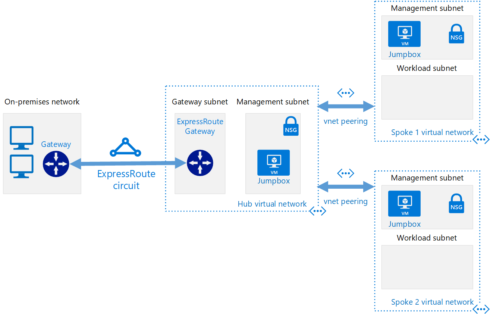

# Hub-spoke Network Topology

Uses Terraform to implement the
[hub-spoke topology reference architecture](https://docs.microsoft.com/en-us/azure/architecture/reference-architectures/hybrid-networking/hub-spoke).

The hub is a virtual network (VNet) in Azure that acts as a central point of connectivity to your on-premises
network. The spokes are VNets that peer with the hub, and can be used to isolate workloads. Traffic flows between
the on-premises datacenter and the hub through an ExpressRoute or VPN gateway connection.



## Getting Started

Before using Terraform it's a good idea to setup a remote backend for secure access.

### Remote Backend Configuration

Configure Azure for secure Terraform access using Azure Key Vault:

```powershell
# Connect to your Azure account
Connect-AzAccount -UseDeviceAuthentication

# Run configuration script
.\scripts\ConfigureAzureForSecureTerraformAccess.ps1 -adminUserDisplayName 'Adam Rush'
```

Load Azure Key Vault secrets into Terraform environment variables for the current PowerShell session:

```powershell
# Run env var load script
.\scripts\LoadAzureTerraformSecretsToEnvVars.ps1

# Confirm env vars loaded
ls env:ARM*
```

### Running Terraform

Now that we have a secure remote backend configured we can go ahead and run Terraform:

```powershell
# Navigate to example folder
cd examples\hub-spoke-network

# Run Terraform
terraform init
terraform plan
..\..\scripts\Invoke-Terraform.ps1 -Command "apply"

# Redisplay outputs if required
terraform output
```

### Cleanup

Once you've finished, remove all resources:

```powershell
# Destroy
..\..\scripts\Invoke-Terraform.ps1 -Command "destroy"
```
